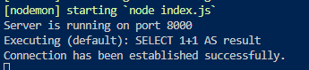

**Cách cài đặt và sử dụng**

**Yêu cầu**

1. [NodeJS](https://nodejs.org/en)
2. [MySQL](https://www.mysql.com/downloads/)
3. [Postman](https://www.postman.com/downloads/)

**Cài đặt**

1. Tại thư mục dự án ngang hàng với index.js tạo file .env giống như file .env.example và điền mật khẩu mysql của bản thân mình, ví dụ mật khẩu là abc thì điền DB_PASS= 'abc'
2. Sau đó chạy câu lệnh `npx sequelize-cli db:create` tại terminal -> khi đó kiểm tra xem database 'Ryoshi' đã được tạo thành công hay chưa
3. Tại terminal chạy `npm i` để tải các thư viện cần thiết
4. Sau đó chạy câu lệnh `npm start` -> kết nối thành công sẽ hiện thông báo như sau:
   

**_Lưu ý:_** _1 và 2 chỉ chạy lần đầu tiên khi clone project về, 3 và 4 chạy mỗi khi git pull code mới về_
