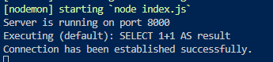

**Cách cài đặt và sử dụng**

**Yêu cầu**

1. [NodeJS](https://nodejs.org/en)
2. [MySQL](https://www.mysql.com/downloads/)
3. [Postman](https://www.postman.com/downloads/)

**Cài đặt khi clone về lần đầu tiên**

1. Tại thư mục dự án ngang hàng với index.js tạo file .env giống như file .env.example và điền mật khẩu mysql của bản thân mình, ví dụ mật khẩu là abc thì điền DB_PASS= 'abc'
2. Tại terminal chạy `npm i` để tải các thư viện cần thiết
3. Sau đó chạy câu lệnh `npx sequelize-cli db:create` tại terminal -> khi đó kiểm tra xem database 'Ryoshi' đã được tạo thành công hay chưa
4. Sau đó chạy câu lệnh `npm start` -> kết nối thành công sẽ hiện thông báo như sau:
   

**Cài đặt khi pull code mới về**

1. Chạy câu lệnh `npm i`
2. Kiểm tra xem file .env.example có gì mới không để thêm các biến môi trường vào file .env của mình
3. Chạy câu lệnh `npx sequelize-cli db:migrate`
4. Cuối cùng chạy câu lệnh `npm start`
